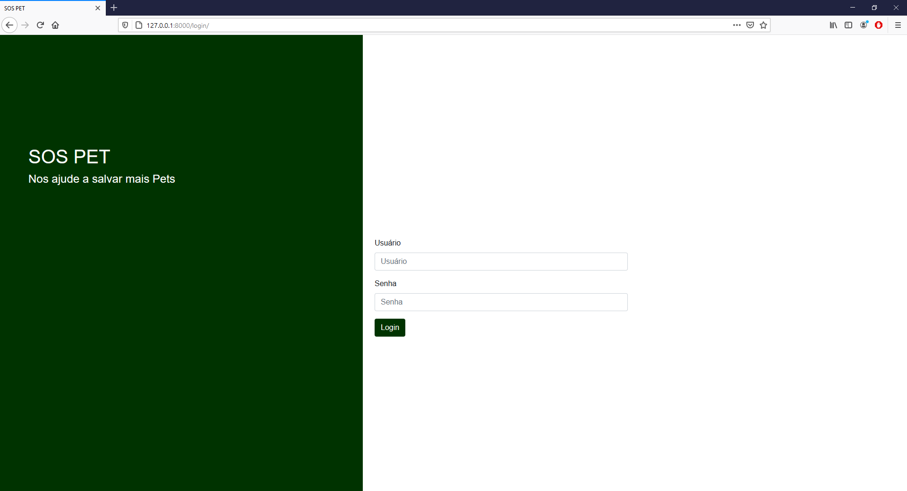
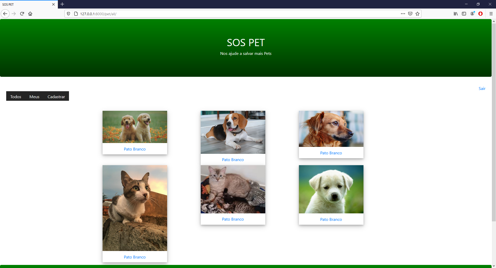
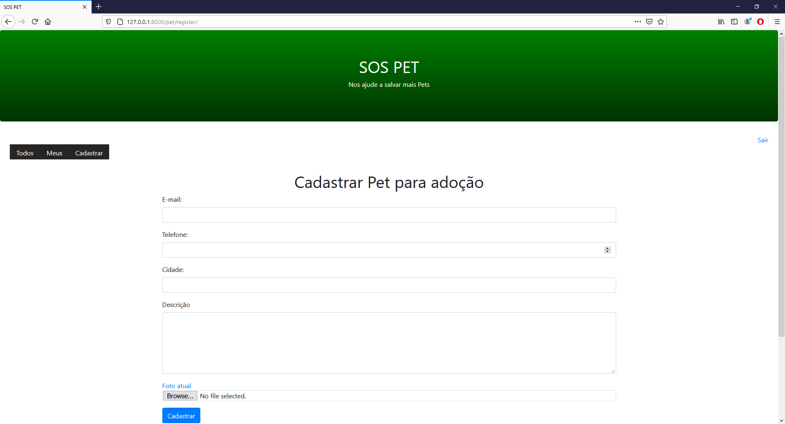
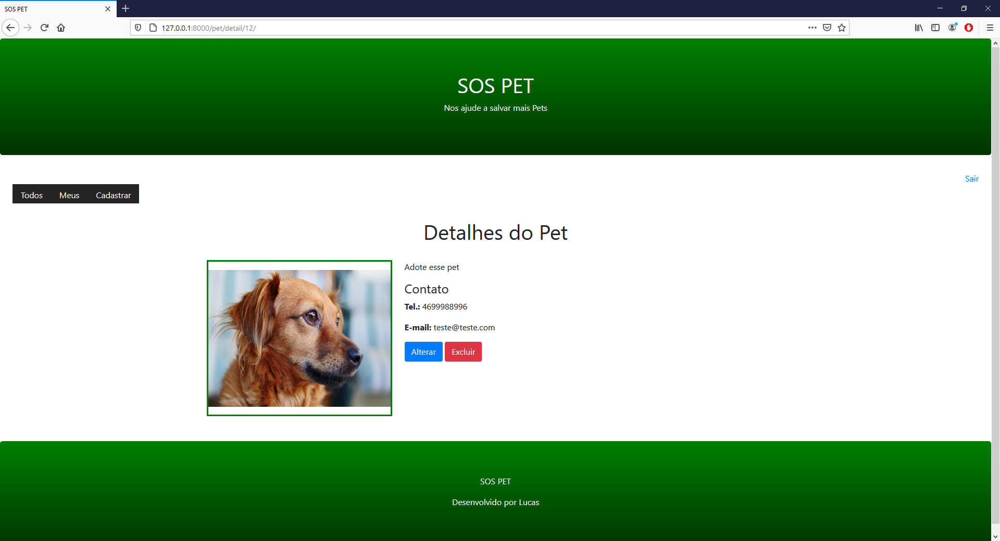

# SOS PET - Plataforma de adoção de Pets

Plataforma para adoção de Pets. Desenvolvido com Python e Django.

## Features

1. Login integrado com Django Admin
2. Cadastro de Pets para adoção

## Preview

### Página de Login
 

### Listagem de Pets para adoção
 

### Cadastro de Pet para adoção
 

### Detalhes do Pet
 

## Demo
[Acessar: pbpet.com](https://pbpet.herokuapp.com/)
 
## Main requirements

Django==3.1.2
Pillow==7.0.0
pytz==2018.7
dj-database-url==0.5.0
gunicorn==20.0.4
psycopg2-binary==2.8.5
whitenoise==5.1.0
